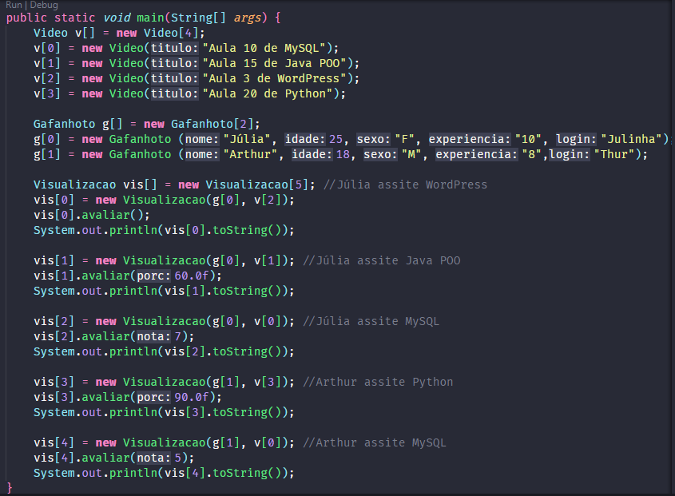
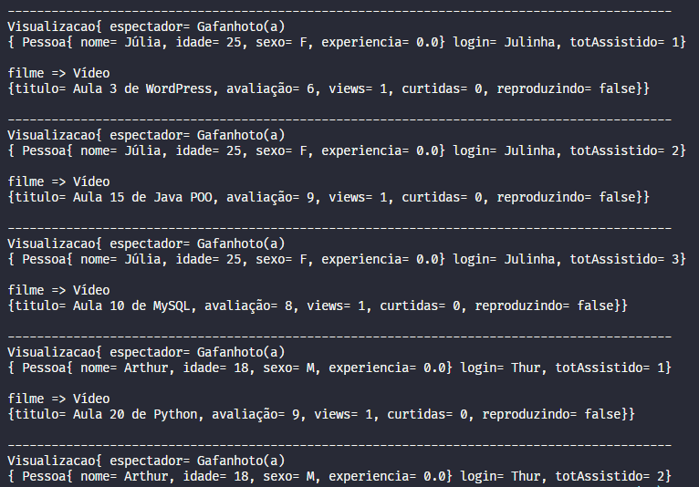
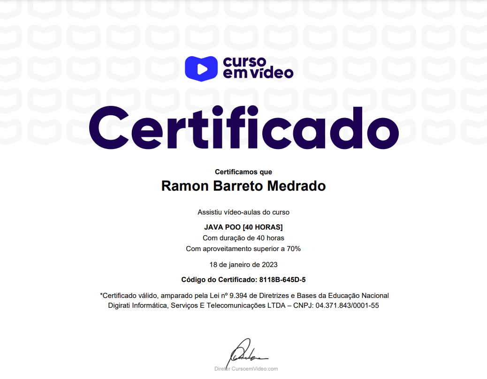

## Projeto &#9758;  

  
  

### Java POO - Curso em Vídeo ☕▶

### Exercício final + certificado 👨🏽‍🎓

Projeto desenvolvido nas últimas aulas do Curso em Vídeo - Java POO. Com esse exercício final foi possível colocar em prática as bases da Orientação a objetos, são elas: <strong>Abstração</strong>, <strong>Encapsulamento</strong>, <strong>Herança</strong> e <strong>Polimorfismo</strong>. Conseguindo representar em código dinâmico a funcionalidade da plataforma Youtube em ação (modelo apenas de representação).

  
## Compilação 👨🏽‍💻

### Inserindo dados no sistema 💻⬅

  

### Tela após compilação ▫▪▫

  

<strong>Características do Programa</strong>

- [x] Realizamos a Relação de agregação entre as classes
- [x] A avaliação pode ser realizada de 3 formas, utilizamos uma sobrecarga do Método Avaliar. Se o usuário não avaliou, a nota padrão será um valor e as outras formas podem ser em porcentagem de visualização do vídeo ou um valor inteiro digitado como nota
- [x] As alterações nos valores de views e outras características mudam dinamicamente, assim como o mecanismo real do youtube

## Tecnologias 🛠

- Java POO ☕

## Meu Certificado 📃🎉

  

## Instrutor 👨🏽‍🏫
- <a target="_blank" href="https://www.linkedin.com/in/guanabara/">Gustavo Guanabara</a>

## Aluno 👨🏽‍🎓

- <a target="_blank" href="https://www.linkedin.com/in/ramon-barreto-076191180/">Ramon Barreto</a>

## Contato 📲

- Email: ramon_barreto_medrado@hotmail.com